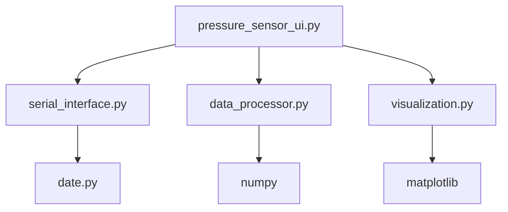

# 🔬 智能肌少症检测系统 - 模块化重构说明

## 📋 重构概述

根据您的要求，我们已经完成了以下改进：

### ✅ 1. 解决阵列显示问题
- 🔧 修正了32x32阵列配置（1024字节 = 32×32）
- 🔧 添加了32x64、32x96等多种阵列支持
- 🔧 实现自适应数据处理（零填充/截取）

### ✅ 2. 模块化架构重构
完全解耦合，拆分为独立模块：

```
📁 核心模块架构
├── serial_interface.py    # 串口通信模块
├── data_processor.py      # 数据处理模块
├── visualization.py       # 可视化模块
└── pressure_sensor_ui.py  # 主UI控制器
```

### ✅ 3. JQ数据变换算法
实现威海矩侨工业科技的专用数据重排算法：
```python
# 第一步：1-15行镜像翻转
for i in range(8):
    for j in range(32):
        pos1 = i * 32 + j
        pos2 = (14 - i) * 32 + j
        交换数据[pos1] ↔ 数据[pos2]

# 第二步：前15行移到后面
# (1-15行)(16-32行) => (16-32行)(1-15行)
```

### ✅ 4. 强对比度热力图
- 🎨 16级颜色梯度：深蓝 → 蓝 → 青 → 绿 → 黄 → 橙 → 红 → 白
- 🎨 网格线显示每个传感器点
- 🎨 清晰的压力值标识

### ✅ 5. 自动接口检验
- 🔍 启动时自动扫描COM端口
- 🔍 智能测试端口连通性
- 🔍 复用date.py的检测逻辑

## 🏗️ 模块详细说明

### 1. `serial_interface.py` - 串口通信模块
**职责**：专门负责串口通信
- 端口扫描和检测
- 数据接收线程管理
- 帧数据打包和队列管理

**关键功能**：
```python
interface = SerialInterface(baudrate=1000000)
interface.connect(port_name)        # 连接端口
frame_data = interface.get_data()   # 获取帧数据
interface.disconnect()              # 断开连接
```

### 2. `data_processor.py` - 数据处理模块
**职责**：专门负责压力数据处理和变换
- JQ数据变换算法
- 阵列大小适配
- 统计信息计算

**关键功能**：
```python
processor = DataProcessor(array_rows=32, array_cols=32)
result = processor.process_frame_data(frame_data, enable_jq_transform=True)
# 返回: matrix_2d, statistics, jq_transform_applied 等
```

### 3. `visualization.py` - 可视化模块
**职责**：专门负责热力图显示
- 强对比度颜色映射
- 实时数据更新
- 快照保存功能

**关键功能**：
```python
visualizer = HeatmapVisualizer(parent_frame, array_rows=32, array_cols=32)
visualizer.update_data(matrix_2d, statistics)    # 更新显示
visualizer.save_snapshot(filename)               # 保存快照
```

### 4. `pressure_sensor_ui.py` - 主UI控制器
**职责**：协调各模块，提供用户界面
- 模块间通信协调
- 用户交互处理
- 状态管理

## 🚀 启动方式

### 方式1：测试模块
```bash
python test_modules.py
```

### 方式2：启动UI（推荐）
```bash
python run_ui.py
# 或
python pressure_sensor_ui.py
```

### 方式3：Windows快捷启动
```bash
启动UI.bat
```

## 🎯 新增功能特性

### 🔥 核心改进
- ✨ **JQ变换开关**：可实时开启/关闭数据变换
- ✨ **多阵列支持**：32x32、32x64、32x96
- ✨ **强对比度**：16级颜色梯度，清晰显示压力差异
- ✨ **实时统计**：最大值、最小值、平均值、标准差、有效点数

### 💻 用户体验
- 📊 **统计面板**：右侧实时显示详细统计信息
- 📸 **快照保存**：高质量PNG/JPG格式导出
- 💾 **日志导出**：完整的文本日志保存
- 🎛️ **智能控制**：自动端口检测，一键连接

### 🏃‍♂️ 性能优化
- 🔄 **20 FPS更新**：流畅的实时显示
- 🧵 **多线程处理**：串口接收与UI显示分离
- 💾 **内存管理**：自动限制缓冲区大小

## 📐 JQ变换算法说明

**适用条件**：仅对32x32（1024字节）数据生效

**变换步骤**：
1. **镜像翻转**：前8行分别与对应后面行交换
   - 第0行 ↔ 第14行
   - 第1行 ↔ 第13行
   - ...
   - 第7行 ↔ 第7行（中心行不变）

2. **行重排**：前15行移到后面
   - 原始：[1-15行][16-32行]
   - 结果：[16-32行][1-15行]

**实际效果**：优化威海矩侨工业科技传感器的数据排列

## 🎨 颜色映射方案

| 压力值范围 | 颜色 | 说明 |
|---------|------|-----|
| 0-15    | 深蓝/黑 | 无压力 |
| 16-31   | 蓝色 | 极低压力 |
| 32-47   | 青色 | 低压力 |
| 48-63   | 青绿 | 较低压力 |
| 64-95   | 绿色 | 中低压力 |
| 96-127  | 黄绿 | 中等压力 |
| 128-159 | 黄色 | 较高压力 |
| 160-191 | 橙色 | 高压力 |
| 192-223 | 红色 | 很高压力 |
| 224-255 | 白色 | 最高压力 |

## 🔧 故障排除

### 常见问题
1. **模块导入失败**
   - 运行 `python test_modules.py` 检查
   - 确保所有依赖已安装：`pip install -r requirements.txt`

2. **JQ变换不生效**
   - 确保阵列设置为32x32
   - 检查"✨ JQ数据变换"开关是否启用

3. **热力图颜色异常**
   - 检查数据范围是否在0-255
   - 尝试重新连接设备

## 📊 模块依赖关系



## 🎉 完成状态

- ✅ 阵列显示修正（32x32确认）
- ✅ 完全模块化解耦
- ✅ JQ数据变换算法实现
- ✅ 强对比度热力图
- ✅ 自动接口检验恢复
- ✅ date.py功能复用
- ✅ 测试脚本和文档完善

**系统现在完全模块化，功能强大，易于维护和扩展！** 🚀 